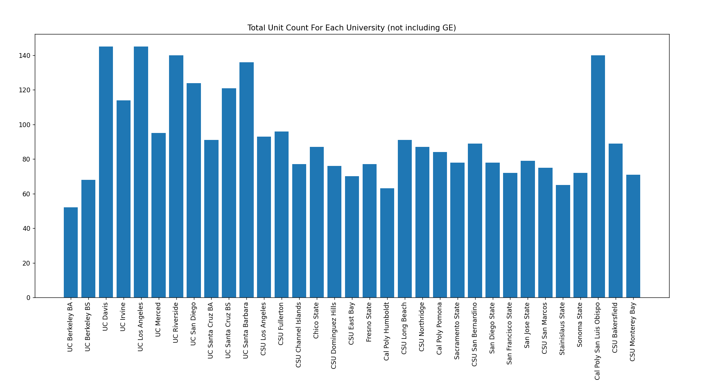
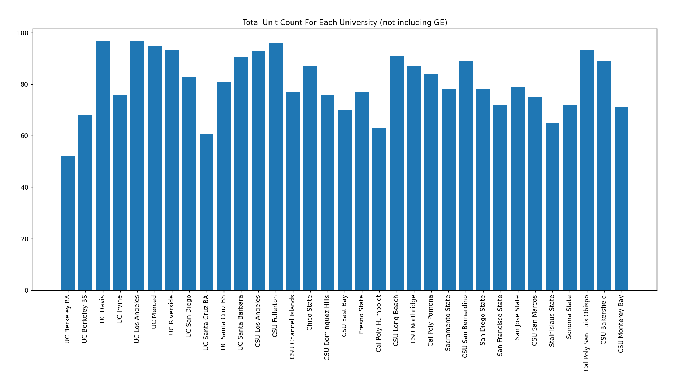

# Notes on findings

## 1. Total unit count

Total units of major requirements for the UCs and CSUs.

Total semester units of major requirements for the UCs and CSUs.

* The schools that require either the physics or chemestry series for graduation have a higher unit count than those that don't, with the exception of UC Berkeley.

* ~~The schools that do not include lower division science electives in their list of required courses for the major may have both a CS and CSE major, where the CSE major requires science courses for graduation. Examples: UC Irvine, UC Berkeley (EECS), UC Davis~~
* The only UCs that do not list science courses as requirements for graduation are UCI, UCB, and UCSC.
* The only CSUs that do not list science courses as requirements are CSU Monterey Bay and Cal Poly Humboldt.
* Sonoma State and CSU Fullerton have a list of math and science classes and have the student choose a few from them. I do not know how to catagorize it. Math or science?